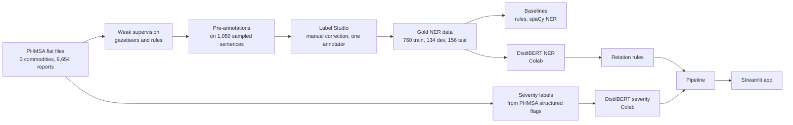
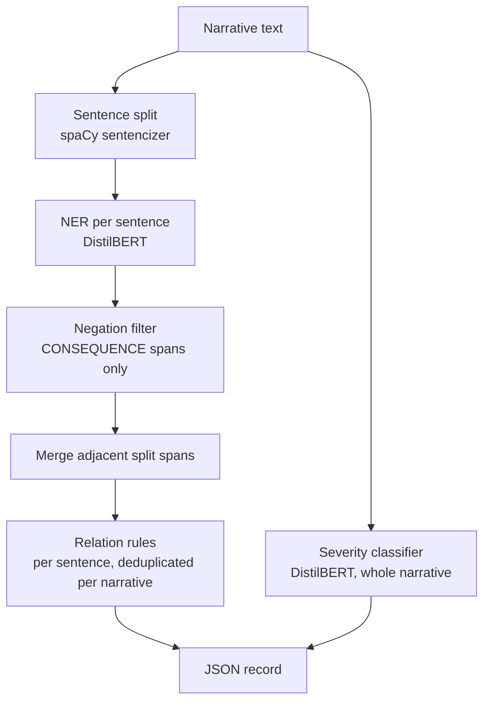

# PHMSA Incident Extraction

**Turning free-text pipeline incident narratives into structured records: entities, relations between them, and a severity prediction.**

Built on public incident reports from the U.S. Pipeline and Hazardous Materials Safety Administration (PHMSA): gas distribution, gas transmission and gathering, and hazardous liquid pipelines, January 2010 to present (9,654 reports).

- **Live demo:** [STREAMLIT APP](https://nlp-on-oil-and-gas-unstructured-data.streamlit.app) (free hosting: the app sleeps when idle, so the first load can be slow)
- **Model weights:** [`Chinonso11/phmsa-incident-models`](https://huggingface.co/Chinonso11/phmsa-incident-models) on the Hugging Face Hub (two DistilBERT models, public)
- **Code and full engineering log:** This repository

> This document is deliberately long. It records every design decision, every iteration, what went wrong and how it was caught, and the exact numbers behind each claim. If you only want the headline, read [Results at a glance](#1-results-at-a-glance) and [Limitations](#14-limitations-and-threats-to-validity).

---

## Table of contents

1. [Results at a glance](#1-results-at-a-glance)
2. [What the system does (example output)](#2-what-the-system-does-example-output)
3. [Architecture](#3-architecture)
4. [Repository layout](#4-repository-layout)
5. [Setup and quickstart](#5-setup-and-quickstart)
6. [Phase 0: Data and schema](#6-phase-0-data-and-schema)
7. [Phase 1: Weak supervision (rule-based labeler)](#7-phase-1-weak-supervision-rule-based-labeler)
8. [Phase 2: Annotation](#8-phase-2-annotation)
9. [Phase 3: Evaluation harness and baselines](#9-phase-3-evaluation-harness-and-baselines)
10. [Phase 4: Transformer NER and the CAUSE_FACTOR investigation](#10-phase-4-transformer-ner-and-the-cause_factor-investigation)
11. [Phase 5: Relation extraction](#11-phase-5-relation-extraction)
12. [Phase 6: Severity classification](#12-phase-6-severity-classification)
13. [Phases 7 and 8: Pipeline integration and deployment](#13-phases-7-and-8-pipeline-integration-and-deployment)
14. [Limitations and threats to validity](#14-limitations-and-threats-to-validity)
15. [Decision register](#15-decision-register)
16. [Mistakes, corrections and dead ends](#16-mistakes-corrections-and-dead-ends)
17. [Known gaps and future work](#17-known-gaps-and-future-work)
18. [Testing and reproduction](#18-testing-and-reproduction)
19. [Data source and notes](#20-data-source-and-notes)

---

## 1. Results at a glance

All numbers are on held-out data that no model or rule was tuned on, unless stated otherwise.

| Component | Method | Held-out result | Baselines |
|---|---|---|---|
| **Entity extraction** (12 types, per sentence) | DistilBERT token classification | **micro-F1 0.608** (precision 0.575, recall 0.645) on 840 gold spans in 156 sentences | rule-based gazetteers 0.371; spaCy statistical NER 0.553 |
| **Relations** (6 active types, per sentence) | Rules over the predicted entities | **68% precision** (61 of 90 sampled relations correct, 95% interval 58 to 77%) | none (no gold relations, so recall is not measured) |
| **Severity** (minor / moderate / severe / critical) | DistilBERT over the whole narrative | **macro-F1 0.777**, accuracy 0.956 on 1,921 narratives | TF-IDF + logistic regression 0.646; always-"minor" 0.230 |

What works well, what does not:

- **Reliable:** quantities (F1 0.85), materials (0.71), dates (0.70), equipment (0.67). Severity on narratives that explicitly state a death (16 of 16 critical test narratives with a death word were detected).
- **Weak:** failure modes (0.45), locations (0.39), regulatory references (0.08). Relation type `REMEDIATED_BY` (6 of 15 correct).
- **Does not work:** root causes (`CAUSE_FACTOR`) are **not extracted** (F1 0.00 in all three models, 14 test spans). Severity cannot detect a death or injury that the narrative never mentions (0 of 11 such critical test narratives).
- **Not measurable at this data size:** per-commodity results on rare classes (for example 2 critical and 3 severe hazardous-liquid test narratives).

The three entity models, scored identically on the same corrected test labels:

| Model | Overall micro-F1 | Gas distribution | Gas transmission and gathering | Hazardous liquid |
|---|---|---|---|---|
| Rule-based gazetteers (Phase 1 pipeline, no training) | 0.371 | 0.311 | 0.416 | 0.401 |
| spaCy statistical NER (CNN, trained on annotations) | 0.553 | 0.558 | 0.548 | 0.554 |
| DistilBERT (fine-tuned) | **0.608** | **0.600** | **0.603** | **0.623** |

---

## 2. What the system does (example output)

Input (a hazardous-liquid report) and the pipeline's actual output from `pipeline/run_pipeline.py`:

```
ON 02/02/2021 AT 6:30 PM, AN ENTERPRISE TECHNICIAN DISCOVERED A LEAK ON THE BODY BLEED OF A 4 INCH VALVE AT
HOBBS STATION.  THE PIPELINE WAS SHUT DOWN AND THE VALVE WAS ISOLATED TO STOP THE LEAK.  THE PLUG WAS REMOVED AND
INTERNAL CORROSION IN THE THREAD OF THE VALVE PLUG WAS OBSERVED.  THE INTERNAL CORROSION CAUSED THE VALVE PLUG TO
BECOME LOOSE.     THE VALVE WAS REMOVED AND REPLACED WITH PIPING.

Severity: minor   (minor 100%, moderate 0%, severe 0%, critical 0%)     PHMSA flag-derived label: minor

Entities:
  ACTION_TAKEN: ['SHUT DOWN', 'ISOLATED', 'REMOVED', 'REPLACED']
  DATE_TIME:    ['02/02/2021', '6:30 PM']
  EQUIPMENT:    ['VALVE', 'PIPELINE', 'PLUG', 'VALVE PLUG', 'PIPING']
  FAILURE_MODE: ['LEAK', 'CORROSION', 'LOOSE']
  LOCATION:     ['HOBBS STATION']
  PARTY_ROLE:   ['ENTERPRISE TECHNICIAN']
  QUANTITY:     ['4 INCH']

Relations:
  s0: VALVE --LOCATED_AT--> HOBBS STATION
  s0: VALVE --HAS_QUANTITY--> 4 INCH (distance)
  s1: LEAK --REMEDIATED_BY--> ISOLATED
  s2: CORROSION --REMEDIATED_BY--> REMOVED
```

This example is shown unedited, including its mistakes. `CORROSION --REMEDIATED_BY--> REMOVED` is wrong (removing the plug *revealed* the corrosion; it did not remediate it). The sentence "the internal corrosion caused the valve plug to become loose" produced no relation, because the rules do not link two failure modes. These are exactly the weaknesses quantified in [Phase 5](#11-phase-5-relation-extraction).

Each narrative produces one JSON record:

```
{
  "commodity_type": str | null,
  "narrative": str,
  "severity": {"label": "minor|moderate|severe|critical", "probabilities": {label: float}} | null,
  "entities":  [{"text", "label", "start", "end", "sentence_index", "unit_type"?}],   # offsets into the narrative
  "relations": [{"type", "confidence": "rule|low", "sentence_index",
                 "head": {text, label, start, end}, "tail": {text, label, start, end, unit_type?}}],
  "dropped_negated": [{"text", "label", "start", "end", "sentence_index"}],           # consequences removed as negated
  "note": str                                                                          # only when severity was skipped
}
```

---

## 3. Architecture

### 3.1 How the models were built



### 3.2 What runs when you submit a narrative



Three deliberate design choices shape everything downstream:

1. **Two models, not one.** Entity tagging is a per-token problem on single sentences; severity is a per-document problem. They have different inputs, labels, class balance and metrics, so they are trained and evaluated separately.
2. **Relations are rules, not a model.** There are no gold relation labels, and annotating them was out of scope. Rules over entity types with proximity and cue words give inspectable behavior, and I measured their precision by hand instead of claiming a learned score.
3. **Everything is per sentence except severity.** The NER model was trained and scored per sentence, and same-sentence relations are the highest-precision option. Cross-sentence links are future work.

---

## 4. Repository layout

```
data/
  raw/                         the three PHMSA flat files (cp1252 text), one folder per commodity
  processed/                   parquet and JSON artifacts (git-ignored where large)
  field_notes.md               confirmed column names, cause taxonomy, units, encodings
schema/phmsa_ner_schema.md     original design (v0.1.0); its section 9 lists where the build deviated
weak_supervision/              Phase 1: gazetteers, matchers, spaCy pipeline, QA scripts
annotation/                    Phase 2-4: sentence prep, sampling, Label Studio config, export parsing,
                               BIO utilities, CAUSE_FACTOR audit and relabel scripts, guidelines
baselines/                     Phase 3: rule-based and spaCy statistical NER baselines, alignment checks
ner_model/                     Phase 4: Colab export script, local inference (predict.py), local re-score check
relation_extraction/           Phase 5: rule-based relation extractor, precision-check tooling
severity_model/                Phase 6: dataset export, TF-IDF baseline, keyword diagnostic, local inference
pipeline/                      Phase 7: IncidentExtractor (end-to-end), CLI runner, offline tests
demo/                          Phase 8: Streamlit app (demo/space), model upload, S3 archive, offline tests
```

---

## 5. Setup and quickstart

**Environment used.** Windows, VS Code, a local Python 3.14 virtual environment for everything except Label Studio, which needs its own Python 3.11 virtual environment (Label Studio fails on 3.14 because `pkgutil.find_loader` was removed). GPU fine-tuning was done on Google Colab (T4). There is no local GPU.

**Core dependencies:** `spacy`, `transformers`, `torch`, `datasets`, `seqeval`, `scikit-learn`, `pandas`, `pyarrow`, `streamlit`, `huggingface_hub`. (`label-studio` lives in its own environment; `boto3` is only needed for the optional S3 archive script.)

**Run the extractor locally.**

```python
# 1. download the two models from the Hugging Face Hub
from huggingface_hub import snapshot_download
path = snapshot_download("Chinonso11/phmsa-incident-models")
# 2. copy <path>/ner      -> ner_model/phmsa_ner_model
#    copy <path>/severity -> severity_model/phmsa_severity_model
```

```
python pipeline/run_pipeline.py                      # one example narrative per commodity
python pipeline/run_pipeline.py --text "YOUR NARRATIVE HERE"
streamlit run demo/space/app.py                      # local copy of the web app (set PHMSA_NER_DIR and
                                                     # PHMSA_SEVERITY_DIR to the two model folders)
```

**Offline tests (no model files needed):**

```
python relation_extraction/extract_relations.py      # relation rule checks
python pipeline/test_incident_extractor.py           # 20 pipeline checks with fake models
python demo/test_demo.py                             # 23 demo checks, incl. a headless Streamlit run
```

The exact order of scripts used to produce every artifact is listed in [How to reproduce](#reproduction-order).

---

## 6. Phase 0: Data and schema

### 6.1 Data

| Commodity | File | Rows |
|---|---|---|
| Gas distribution | `incident_gas_distribution_jan2010_present.txt` | 1,592 |
| Gas transmission and gathering | `incident_gas_transmission_gathering_jan2010_present.txt` | 2,053 |
| Hazardous liquid | `accident_hazardous_liquid_jan2010_present.txt` | 6,009 |
| **Total** | | **9,654** |

Each row is one incident report with many structured columns plus a free-text narrative. The files are tab-delimited text in **cp1252** encoding (not UTF-8). Narratives are almost entirely upper-case.

**Why I audited columns before writing any model code.** The three commodities do not share a schema. I wrote the findings into `data/field_notes.md` with confirmed column names so that every later gazetteer rests on a field I had actually inspected:

- **Cause taxonomy is not a flat CAUSE/SUBCAUSE pair.** It branches into eight cause groups (G1 to G8) per commodity, and each group has its own detail fields (equipment failure type, natural force type, party type, and so on). This is why the failure-mode gazetteer is organized into 24 source groups instead of one list.
- **Equipment fields differ.** Gas distribution has only a coarse `SYSTEM_PART_INVOLVED`. Gas transmission and hazardous liquid have both the coarse field and a granular `ITEM_INVOLVED`. So equipment patterns come from 8 source groups with different coverage per commodity.
- **`ROOT_CAUSE_CATEGORY` and `ROOT_CAUSE_TYPE` come from the excavation-damage section**, so they cannot be treated as a general cause label. Checked on the loaded data in all three commodities: the field is filled for 98 to 99% of excavation-damage reports and for none of the others. (The first version of the field notes called it universal in gas distribution; that was wrong.)
- **Units differ.** Gas volumes are in mcf (`UNINTENTIONAL_RELEASE`, `INTENTIONAL_RELEASE`; confirmed for gas distribution, assumed the same for gas transmission and gathering); hazardous liquid volumes are in barrels (`UNINTENTIONAL_RELEASE_BBLS`, `RECOVERED_BBLS`). The quantity matcher therefore distinguishes gas volume from liquid volume.

**The cause mix differs sharply by commodity** (counts of reports per value of the `CAUSE` column, from the loaded data; the three counts per row add up to the file row counts above):

| Cause category | Gas distribution | Gas transmission and gathering | Hazardous liquid |
|---|---|---|---|
| Corrosion failure | 39 | 406 | 1,318 |
| Equipment failure | 62 | 702 | 2,740 |
| Excavation damage | 549 | 223 | 199 |
| Incorrect operation | 116 | 138 | 832 |
| Natural force damage | 113 | 155 | 263 |
| Other outside force damage | 481 | 115 | 125 |
| Pipe, weld or joint failure (gas distribution wording) / material failure of pipe or weld (the other two) | 102 | 221 | 405 |
| Other incident cause (hazardous liquid: other accident cause) | 130 | 93 | 127 |
| **Total** | **1,592** | **2,053** | **6,009** |

Excavation damage is 34% of gas distribution reports but 3% of hazardous liquid, where equipment failure alone is 46%. This is one reason results are reported per commodity as well as overall.

**Combined file.** `data/processed/phmsa_combined_raw.parquet` holds all 9,654 rows with a `commodity_type` column. Writing it first failed with a pyarrow mixed-type error (columns holding both numbers and text), so every object column is forced to string before saving.

### 6.2 Schema (v0.1.0)

`schema/phmsa_ner_schema.md` defines 12 entity types, 7 relation types and the severity classifier. It is the original v0.1.0 design document; its section 9 lists where the finished project deviated from it.

| Entity | Meaning |
|---|---|
| `EQUIPMENT` | physical pipeline components |
| `FAILURE_MODE` | what broke and how (the mechanism) |
| `CAUSE_FACTOR` | the root cause (why it happened) |
| `ACTION_TAKEN` | a deliberate response after the incident |
| `CONSEQUENCE` | the resulting outcome |
| `QUANTITY` | number plus unit as one span |
| `LOCATION`, `DATE_TIME`, `MATERIAL_SPEC` | attributes |
| `INSPECTION_FINDING` | what an inspection or examination found |
| `PARTY_ROLE` | a party's role in the incident (not a bare company name) |
| `REGULATORY_REF` | citations of rules, procedures or codes |

Relations: `CAUSED_BY`, `RESULTED_IN`, `REMEDIATED_BY`, `LOCATED_AT`, `HAS_QUANTITY`, `INVOLVES_PARTY`, `MADE_OF`.

**Design rule 1: flat NER only.** When two spans nest, the more specific, lower-level entity wins and the outer span is not tagged at all. I chose flat spans because standard token classification and `seqeval` scoring assume them. The cost is that broad spans such as "LEAKING MAINLINE VALVE" (a cause) lose to the narrower "MAINLINE VALVE" (equipment) inside them. The effect of that rule was measured later (section 10.5).

The 12 types cover a causal chain (what failed, how, why, what was done, what resulted) plus the attributes needed to ground it (where, when, how much, made of what, who, under which rule).

---

## 7. Phase 1: Weak supervision (rule-based labeler)

### 7.1 Why

Two reasons. First, to **bootstrap annotation**: pre-labeling the sentences I would correct by hand is faster than labeling from scratch. Second, to get a **rule-based baseline** that every learned model must beat. The cost is a known risk, **anchoring**: an annotator correcting pre-filled labels may accept a wrong span more often than they would have written it. I accepted that for speed and flag it in the limitations.

### 7.2 Components (all in `weak_supervision/`)

| File | What it labels | Size and source |
|---|---|---|
| `equipment_gazetteer.py` | `EQUIPMENT` | 168 patterns, 8 source groups (PHMSA field value lists) |
| `cause_gazetteer.py` | `FAILURE_MODE` | 164 patterns, 24 source groups; each pattern tagged VERBATIM (taken as written in a PHMSA field) or DERIVED (constructed from field values) |
| `quantity_matcher.py` | `QUANTITY` | 6 rules: gas volume, liquid volume, pressure, distance, currency, percentage |
| `consequence_action_gazetteer.py` | `CONSEQUENCE`, `ACTION_TAKEN` | 32 and 43 patterns |
| `build_pipeline.py` | assembles the spaCy pipeline | `EntityRuler` with 407 patterns (168 + 164 + 32 + 43) plus filters |
| `run_weak_labels.py` | runs it over all 9,654 narratives | writes `weak_labeled_narratives.parquet` |
| `severity_weak_labels.py` | narrative severity (section 7.6) | writes `phmsa_combined_with_severity.parquet` |
| `verify_fixes.py`, `verify_consequence.py`, `measure_negation.py`, `measure_negation_other.py` | QA scripts that confirmed each fix below | |

**No gazetteers exist for seven types** (`CAUSE_FACTOR`, `DATE_TIME`, `LOCATION`, `MATERIAL_SPEC`, `INSPECTION_FINDING`, `PARTY_ROLE`, `REGULATORY_REF`). They were annotated from scratch, and the rule baseline correctly scores 0.000 on them. Any non-zero score a trained model gets on those types is therefore real learning, not leakage from the rules.

**Pipeline order** (standard spaCy components plus the custom ones): `tok2vec` → `tagger` → `entity_ruler` → `parser` → `attribute_ruler` → `lemmatizer` → `fire_service_filter` → `negation_filter` → `quantity_component`. The filters run after the ruler because they remove or reject spans the ruler created; the quantity component runs last so its numeric spans are not disturbed by the others. The `EntityRuler` uses `phrase_matcher_attr="LOWER"` because the narratives are upper-case while the patterns come from mixed-case form values.

### 7.3 Twelve bugs found by spot-checking matches, and each fix

I spot-checked sampled matches and measured false-positive rates for suspicious patterns; each row is a real failure that I fixed and re-verified with the QA scripts.

| # | Symptom | Cause | Fix |
|---|---|---|---|
| 1 | Upper-case narratives did not match mixed-case patterns | Case-sensitive matching | `phrase_matcher_attr="LOWER"` |
| 2 | "PLASTIC" tagged as `FAILURE_MODE` | A valve-material list sat in the failure-mode source group | Material terms removed (they belong to `MATERIAL_SPEC`) |
| 3 | "RELIEF VALVE", "VALVE" tagged `FAILURE_MODE` | Component names inside a cause group | Moved to the equipment gazetteer as `G6_CONNECTION_COMPONENTS` |
| 4 | "External/Internal Corrosion" untagged | No pattern covered it | Added `G1_INTERNAL_EXTERNAL_SELECTOR` |
| 5 | "Service" matched 80% false positives | A bare common word | Replaced with "Service Line" |
| 6 | "Roof" 100% false positives | Bare word | Removed; kept "Roof Seal" and "Roof Drain System" |
| 7 | "Mixer" 75% false positives | Bare word | Replaced with "Tank Mixer" |
| 8 | "CONSTRUCTION" tagged `FAILURE_MODE` | A category-type list of generic English words | Whole list removed |
| 9 | "O-RING", "PIPE NIPPLE" tagged `FAILURE_MODE` | Components in a cause group | Moved to the equipment gazetteer |
| 10 | "75, IN" tagged as a distance | Bare "in" read as inches | Bare "in" only after short plain numbers; hyphenated form needs no whitespace around the hyphen |
| 11 | "FIRE" tagged `CONSEQUENCE` in "fire department", "fire marshal" | Fire service is not a fire | Filter with fire-service words plus prefix stems that catch plurals, possessives and typos |
| 12 | "NO FATALITIES" produced a `CONSEQUENCE` | Negation not handled | Negation filter (below) |

### 7.4 The two filters

- **Fire-service filter.** "Fire" counts as a consequence only for an actual fire. A word list (`FIRE_SERVICE_WORDS`: department, dept, marshal, and similar) plus prefix `FIRE_SERVICE_STEMS` rejects the match.
- **Negation filter.** Terms `{fatality, fatalities, injury, injuries, leaks}` are dropped when a negation word precedes them within a 5-token window, including the "NO X OR Y" pattern. I measured before and after: `CONSEQUENCE` spans that were negated fell from **5.7% to 2.7%**. `EQUIPMENT` (0.8%) and `FAILURE_MODE` (1.2%) needed no filter. Residual negation for "leaks" and "injuries" stayed around 17 to 21%, which I accepted because human annotation would correct it.

### 7.5 Output statistics

Over all 9,654 narratives: about 11 to 12 entities per narrative, **1.1% of narratives with zero entities**, and consistent behavior across all three commodities (no commodity was silently failing).

### 7.6 Severity labels (programmatic, not text-based)

`severity_weak_labels.py` derives a four-class severity from four structured yes/no columns (`FATALITY_IND`, `INJURY_IND`, `IGNITE_IND`, `EXPLODE_IND`, all confirmed YES/NO):

| Class | Rule |
|---|---|
| critical | a fatality is recorded |
| severe | an injury is recorded (no fatality) |
| moderate | ignition or explosion recorded, no injury or fatality |
| minor | none of the above |

Distribution over all 9,654 reports: **minor 8,195 / moderate 994 / severe 330 / critical 135**.

**Known artifact.** The rule has no spill-size or environmental-impact term, so **97% of hazardous-liquid reports are "minor"** regardless of how much was released. That is a property of the label definition, not of any model, and it is carried through to Phase 6 (see section 12.1).

---

## 8. Phase 2: Annotation

### 8.1 Sentence preparation (`annotation/prepare_sentences.py`)

Narratives are split into sentences with spaCy's rule-based sentencizer, and each weak label is re-offset from narrative level to sentence level. Result: **89,052 sentences** from 9,654 narratives. **4 entities were dropped** because they straddled a sentence boundary.

**Why sentences.** They are a manageable unit for a human to correct in a browser tool, they fit comfortably inside a transformer's input window, and they match the unit used at inference time (the pipeline also tags sentence by sentence).

### 8.2 Sampling (`annotation/sample_for_annotation.py`)

**1,050 sentences**: 350 per commodity, stratified by severity (20% critical, 20% severe, 20% moderate, 35% minor, plus 5% sentences with zero weak-label entities).

**Why not sample uniformly.** Critical and severe incidents are rare (1.4% and 3.4% of reports), so uniform sampling would yield very few sentences describing serious consequences and the actions and causes around them. Oversampling them gives the model and the evaluation real coverage of those contexts, and the 5% zero-entity slice teaches the model what contains no entities. **Consequence:** the annotated set (and so the NER test set) is enriched for serious incidents on purpose. Its scores are not estimates for the natural population of PHMSA sentences.

### 8.3 Tooling

| Item | Decision |
|---|---|
| Annotation tool | Label Studio, with `annotation/label_config.xml` (all 12 types, colour-coded) |
| Pre-annotation | `annotation/export_label_studio.py` writes `label_studio_import.json`: 1,050 tasks with the weak labels attached as predictions, so the annotator corrects instead of starting blank |
| Environment | Label Studio runs in a separate **Python 3.11** virtual environment (it crashes on 3.14 with `pkgutil.find_loader` removed); `django-environ` had to be upgraded to 0.14.0 to fix the first crash |

### 8.4 Annotation guidelines (`annotation/ANNOTATION_GUIDELINES.md`)

The guidelines grew while annotating. The rules that mattered:

| Type | Rule |
|---|---|
| `EQUIPMENT` | pipeline-related physical components |
| `FAILURE_MODE` | what broke and how (the mechanism) |
| `CAUSE_FACTOR` | the root cause (why). **Do not tag** when the report says the cause is still under investigation. **Negation-as-cause exception:** tag an expected-but-absent condition even though it is negated (for example "NOT PROPERLY MARKED") |
| `ACTION_TAKEN` | any deliberate response **after** the incident, physical or organizational; not preventive steps taken before |
| `CONSEQUENCE` | the resulting outcome only, not the triggering event; **never tag negated mentions** ("no fatalities") |
| `QUANTITY` | number and unit as one span |
| `LOCATION`, `DATE_TIME`, `MATERIAL_SPEC`, `INSPECTION_FINDING`, `PARTY_ROLE`, `REGULATORY_REF` | tagged from scratch (no pre-labels) |

Edge cases settled during annotation:

- "Fire" is a `CONSEQUENCE` only for an actual fire, never for fire service ("fire department", "fire marshal").
- Corrosion is internal **or** external for a given incident, not both.
- No duplicate tags on the same span (one early task had `CONSEQUENCE` and `ACTION_TAKEN` on the identical span).
- `PARTY_ROLE` needs a described role or action, not just a company name.

**Result:** 1,050 sentences labeled and submitted by one annotator.

### 8.5 What the annotation process left behind (found later, not planned)

These conventions only became visible in later error analysis. They explain several downstream results, so I record them here:

- **`MATERIAL_SPEC` includes substances**, not only construction materials: gas, crude oil, CO2, hydrocarbons, soil and ice all appear as `MATERIAL_SPEC` spans in the gold data. That is why the first relation extractor produced "piping made of GAS" (section 11.2).
- **`CAUSE_FACTOR` was inconsistent**: roughly two thirds of a random sample of its spans were generic words, consequences or things that broke (section 10.4).
- **Model output suggests** generic place words (curb, sidewalk, outside) are being tagged as `LOCATION`, and the generic word "incident" as a `CONSEQUENCE`.
- There was **no second annotator**, so there is no inter-annotator agreement figure. Label quality is unmeasured.

---

## 9. Phase 3: Evaluation harness and baselines

### 9.1 Protocol

| Item | Decision |
|---|---|
| Parsing | `annotation/parse_export.py` turns the Label Studio JSON into `annotated_sentences.parquet` |
| Split | `annotation/train_test_split.py`: 85/15 **per commodity** into `ner_train.parquet` (894 sentences) and `ner_test.parquet` (156) |
| Train/dev | `ner_train` shuffled with seed 42; the first 15% (134 sentences) is **dev**, the remaining **760** is train. The spaCy baseline and the transformer use exactly this split |
| Tokenization for scoring | one shared function, `annotation/bio_utils.py::spans_to_bio`, using spaCy's blank English tokenizer to turn character spans into BIO tags. Every scorer and exporter uses it, so all models are compared on identical tokens |
| Metric | `seqeval` entity-level precision, recall and F1 (a span counts only if both boundaries and the label match), micro and per type, overall and per commodity |
| Dev vs test | Hyperparameters and checkpoints were chosen on dev. The test set is 156 sentences, **840 gold spans** after label cleaning (843 before) |

**The split is sentence-level and per commodity; it is not grouped by narrative.** I did not verify that no narrative contributed sentences to both train and test (with 1,050 sentences sampled out of 89,052 it should be uncommon). It is listed under limitations.

### 9.2 Problem 1: overlapping annotations crashed spaCy conversion

`convert_to_spacy.py` failed with `E1010: Unable to set entity information for token 8 which is included in more than one span`. spaCy's `doc.ents` cannot hold two labels on one token.

- **My first diagnosis was wrong.** I assumed leftover duplicate tags like the one caught during annotation. `baselines/find_overlaps.py` showed otherwise: about **50 overlapping pairs**, mostly genuine nesting where a narrow correct span sits inside a broader one (for example `EQUIPMENT "GIRTH WELD"` inside `INSPECTION_FINDING "FAILURE INITIATED AT THE GIRTH WELD"`, or `EQUIPMENT "GASKET"` inside `CAUSE_FACTOR "BLOWN INSULATING GASKET"`).
- **Decision: resolve automatically with the schema's own rule instead of hand-editing.** `resolve_overlaps` (in `bio_utils.py`) sorts spans by length, keeps narrow spans first, and drops any broader span that collides with a kept one. It drops the broader span entirely instead of trimming it. Hand-fixing about 50 pairs was possible but slow, and the rule was already written in the schema, so automation was the faithful choice. The effect on each label was measured later (section 10.5).
- Applied to the **gold labels in every exporter and scorer**.

### 9.3 Problem 2: 20 to 25% of entities silently skipped

After the overlap fix, conversion reported **909 / 142 / 182 entities skipped** (train / dev / test) for "bad token alignment". That is not noise: it would have trained the spaCy baseline on data missing about a quarter of its entities and made the comparison unfair.

- **Cause.** `Doc.char_span()` returns nothing unless a span lands exactly on token boundaries. Label Studio lets annotators drag-select spans that include a trailing or leading space (`'MAIN '`, `'GAS '`).
- **Fix.** `alignment_mode="contract"` trims spans inward to the nearest token boundaries. Skips fell to **11 / 2 / 0**, which are genuinely degenerate spans (one or two characters, or only punctuation).
- **Check on the other path.** The BIO converter used by the scorers matches on character overlap, so it was never silently dropping spans, but I verified instead of assuming: `baselines/check_bio_alignment.py` flagged **0 of 156** test sentences.

### 9.4 Problem 3: Baseline A was first scored against unresolved gold

The first rule-based run did not apply `resolve_overlaps` to the gold side, so gold BIO tags at overlap points depended on list order. I reran after fixing it: micro-F1 **0.355 → 0.369** (precision 0.720 → 0.749, recall 0.235 → 0.244). Every figure in this document uses the corrected gold.

### 9.5 Baseline A: rule-based gazetteers (`baselines/baseline_rule_based.py`)

The Phase 1 pipeline run directly on the test sentences, no training. It has high precision and low recall where a gazetteer exists and exactly 0 on the seven types without one. Final score on the cleaned test labels: **micro-F1 0.371** (precision 0.753, recall 0.246).

### 9.6 Baseline B: spaCy statistical NER (`baselines/convert_to_spacy.py`, `baseline_spacy_statistical.py`)

Config generated with `python -m spacy init config --lang en --pipeline ner --optimize efficiency`, trained on CPU with `python -m spacy train` on the 760/134 split. The dev score plateaued around 0.54 by epoch 3 to 5 and spaCy's default patience ran it to epoch 187; evaluation uses the best-on-dev checkpoint. First score **0.542** (original labels), **0.553** on the cleaned labels.

**Why two baselines.** The rule-based one is the floor of "no learning". The spaCy one is the floor of "learning with no pretraining". A transformer's gain over each tells you what pretraining and fine-tuning actually add.

---

## 10. Phase 4: Transformer NER and the CAUSE_FACTOR investigation

### 10.1 Model and data export

| Item | Decision and reason |
|---|---|
| Model | `distilbert-base-uncased` with a token-classification head. **Uncased** because the text is upper-case, so casing carries no signal and the smaller vocabulary is free. DistilBERT over BERT-base for speed and memory on a small dataset; BERT-base was **not tried**. |
| Labels | `O` plus `B-` and `I-` for each of 12 types = **25 labels** |
| Export | `ner_model/export_for_colab.py` applies the same `resolve_overlaps` and `spans_to_bio` as both baselines and the same seed-42 train/dev split as the spaCy baseline, then writes `ner_colab_export.json`. So the transformer trains on exactly the gold labels the baselines were scored against |
| Sub-word alignment | Standard first-sub-word scheme: a word's tag goes on its first sub-word piece, and the remaining pieces get `-100` so the loss ignores them. At inference the first sub-word's prediction is used per word |
| Compute | Google Colab with the Hugging Face `Trainer`. No local GPU |

### 10.2 Training runs

Common settings: batch size 16 (train and eval), weight decay 0.01, evaluate and save every epoch, `load_best_model_at_end` on dev micro-F1 (`seqeval`).

| Run | Labels | LR | Epoch cap | Early stopping | Best epoch (dev F1) | Test micro-F1 |
|---|---|---|---|---|---|---|
| 1 | original | 3e-5 | 15 | none | 12 (0.6006) | 0.607 |
| 2 | original | 2e-5 | 8 | patience 3 | 8, hit the cap (0.5691) | not scored |
| 3 | original | 2e-5 | 15 | patience 3 | 11 (0.5967), stopped at 14 | 0.600 |
| 4 | **cleaned** (final) | 2e-5 | 15 | patience 3 | 6 (0.5949), stopped at 9 | **0.608** |

Why each change:

- **Run 1 → 2.** Dev F1 stopped improving around epoch 4 (about 0.59) while validation loss climbed steadily (0.676 at epoch 4 to 0.855 at epoch 15): the textbook overfitting signature on about 760 training sentences. `load_best_model_at_end` had already protected the saved model, but 15 epochs was wasted compute. So I lowered the learning rate, cut the cap, and added `EarlyStoppingCallback`.
- **Run 2 → 3.** Run 2 ended because it hit the 8-epoch cap, not because it converged (it was still recovering after an epoch-7 dip). I raised the cap to 15 so early stopping could do its job.
- **Run 3 → 4.** Re-trained on the cleaned `CAUSE_FACTOR` labels (section 10.4); stopped itself at epoch 9.
- **The "suspiciously constant" training loss was not a bug.** The `Trainer` logs training loss every 500 steps by default, so with 48 steps per epoch the first value appears around epoch 11 and repeats afterwards.
- **Selection discipline.** Checkpoints and epochs were chosen on dev. I did look at test scores for runs 1 and 3 (0.607 vs 0.600). The 0.007 gap on 843 spans is noise, so I did not pick between them on test; I report the final protocol's run (run 4).
- **The first NER run took 1 h 07 min for 720 steps**, which is a CPU-speed signature; I only noticed that the Colab runtime had not been on a GPU when the severity run (Phase 6) projected 50 hours. Results are unaffected, only slower.

### 10.3 Results (cleaned labels, test set, entity-level `seqeval`)

| Type | Test support | Rule F1 | spaCy F1 | DistilBERT precision | DistilBERT recall | DistilBERT F1 |
|---|---|---|---|---|---|---|
| ACTION_TAKEN | 94 | 0.543 | 0.527 | 0.570 | 0.479 | 0.520 |
| CAUSE_FACTOR | 14 | 0.000 | 0.000 | 0.000 | 0.000 | 0.000 |
| CONSEQUENCE | 83 | 0.686 | 0.659 | 0.593 | 0.651 | 0.621 |
| DATE_TIME | 67 | 0.000 | 0.637 | 0.667 | 0.746 | 0.704 |
| EQUIPMENT | 214 | 0.416 | 0.569 | 0.620 | 0.738 | 0.674 |
| FAILURE_MODE | 54 | 0.269 | 0.478 | 0.439 | 0.463 | 0.450 |
| INSPECTION_FINDING | 1 | 0.000 | 0.000 | 0.000 | 0.000 | 0.000 |
| LOCATION | 55 | 0.000 | 0.232 | 0.329 | 0.473 | 0.388 |
| MATERIAL_SPEC | 56 | 0.000 | 0.702 | 0.630 | 0.821 | 0.713 |
| PARTY_ROLE | 125 | 0.000 | 0.525 | 0.525 | 0.672 | 0.589 |
| QUANTITY | 61 | 0.734 | 0.730 | 0.828 | 0.869 | 0.848 |
| REGULATORY_REF | 16 | 0.000 | 0.261 | 0.111 | 0.062 | 0.080 |
| **micro average** | **840** | **0.371** | **0.553** | **0.575** | **0.645** | **0.608** |

DistilBERT macro-F1 is 0.466 and weighted-F1 0.600. By commodity (micro-F1, precision / recall): gas distribution **0.600** (0.609 / 0.592) on 326 spans, gas transmission and gathering **0.603** (0.556 / 0.658) on 263, hazardous liquid **0.623** (0.561 / 0.701) on 251.

**Reading the table honestly:**

- **DistilBERT does not win every type.** The rule-based gazetteers beat it on `ACTION_TAKEN` (0.543 vs 0.520) and `CONSEQUENCE` (0.686 vs 0.621), types where the controlled-vocabulary patterns have high precision. The spaCy model also edges it on `ACTION_TAKEN`, `CONSEQUENCE`, `FAILURE_MODE` and `REGULATORY_REF`. The transformer's overall lead comes from the types the rules cannot see at all (dates, locations, materials, parties) plus equipment and quantities.
- **Types with fewer than about 60 test spans are noisy.** `REGULATORY_REF` fell from 0.296 to 0.080 between two runs whose `REGULATORY_REF` labels were identical; that is chance on 16 spans, not a trend.
- **The commodity differences (0.600, 0.603, 0.623) are small and within noise** at these sample sizes.

**Original-label results, for transparency** (before the `CAUSE_FACTOR` cleanup; test support 843):

| Model | Overall | Gas distribution | Gas transmission and gathering | Hazardous liquid |
|---|---|---|---|---|
| Rule-based | 0.369 | 0.304 | 0.416 | 0.401 |
| spaCy statistical | 0.542 | 0.518 | 0.545 | 0.570 |
| DistilBERT run 1 | 0.607 | 0.599 | 0.610 | 0.613 |
| DistilBERT run 3 | 0.600 | 0.582 | 0.604 | 0.618 |

The cleanup changed about 1.4% of spans, and every model moved by about one point. I treat that as no measurable change in the headline; the cleaned numbers are used everywhere else because the test labels changed.

### 10.4 The CAUSE_FACTOR investigation

**Observation.** `CAUSE_FACTOR` scored exactly 0.000 in all three models on every commodity. A pretrained transformer did not move it at all.

**Four hypotheses, tested in order.**

1. **Too few examples.** Rejected. I first concluded that were about 15 to 20 training examples; that was wrong. There were 165 `CAUSE_FACTOR` spans in total (21 of them in the original test set, the rest in train and dev).
2. **The flat-span overlap rule deletes the broad cause spans.** Rejected: only 13 of 165 (8%) were dropped (table in section 10.5).
3. **Boundary strictness on long vague spans.** Rejected: the spans are short (median 2 words, maximum 9, measured with `annotation/cause_factor_audit.py`).
4. **Label inconsistency.** **Supported.** I read 40 random `CAUSE_FACTOR` spans. About a third were clear causes ("DIFFERENTIAL SOIL SETTLEMENT", "DREDGING OPERATION", "IMPROPER INSTALLATION", "COATING DETERIORATION"). The rest were generic words ("ROOT CAUSE", "CAUSE", "SOURCE", "GAS", "FORCE"), consequences ("FIRE" several times, "RELEASE", "LOSS") or the thing that broke ("RUPTURED", "DISENGAGED", "SEAL FAILURE", "MECHANICAL FAILURE"). No model can learn a stable pattern from a mixed concept.


**Decision to relabel, and how.** Relabeling mattered because the `CAUSED_BY` relation depends on `CAUSE_FACTOR`. The procedure:

1. Export all 165 spans with their sentences to a CSV (`annotation/export_cause_factor_review.py`).
2. Apply a four-way rubric to each span in context: **keep** (a genuine cause), **FM** (relabel `FAILURE_MODE`: the thing that broke or the mechanism), **CON** (relabel `CONSEQUENCE`: an outcome), **DROP** (a generic word or not a cause).
3. Apply the decisions by script (`annotation/apply_cause_factor_review.py`). The script **always rebuilds from `*_v1.parquet` backups**, so the original labels are preserved and the step can be re-run or undone.

A first pass judged from span text alone (78 decisions) was replaced by a second pass that read each full sentence (**80 decisions: 24 FM, 22 CON, 34 DROP; 85 spans kept**). Applied to the splits: train and dev 72 changes (CON 20, FM 21, DROP 31), test 8 changes (FM 3, DROP 3, CON 2); remaining `CAUSE_FACTOR` spans 69 in train and 16 in test (14 after overlap resolution). The apply script matches each decision on (report index, character offsets, span text), not on row position.

**Outcome.** The relabel moved 46 spans into `FAILURE_MODE` and `CONSEQUENCE` and removed 34. Headline F1 moved by about one point for every model (section 10.3). `CONSEQUENCE` for DistilBERT improved from 0.570 to 0.621, consistent with cleaner labels. **`CAUSE_FACTOR` stayed at 0.000** on the 14 test spans. My best explanation is that about 85 examples of a heterogeneous concept is too few, but that is not proven.

**Consequences downstream.** `CAUSE_FACTOR` is documented as **not extracted**. The two relations that need it (`CAUSED_BY` from a failure mode to a cause factor, and `INVOLVES_PARTY`) never fire and are marked low-confidence; a cue-word `CAUSED_BY` between a consequence and a failure mode was added to give the pipeline some "why" without it (section 11).

### 10.5 What the flat-span overlap rule cost, per label

Gold spans before and after `resolve_overlaps` over all 1,050 annotated sentences (`annotation/overlap_loss_by_label.py`):

| Label | Before | After | Dropped | Share |
|---|---|---|---|---|
| EQUIPMENT | 1,281 | 1,278 | 3 | 0% |
| PARTY_ROLE | 778 | 774 | 4 | 1% |
| ACTION_TAKEN | 665 | 660 | 5 | 1% |
| CONSEQUENCE | 497 | 494 | 3 | 1% |
| DATE_TIME | 440 | 438 | 2 | 0% |
| MATERIAL_SPEC | 439 | 438 | 1 | 0% |
| QUANTITY | 438 | 438 | 0 | 0% |
| LOCATION | 427 | 417 | 10 | 2% |
| FAILURE_MODE | 354 | 349 | 5 | 1% |
| CAUSE_FACTOR | 165 | 152 | 13 | 8% |
| REGULATORY_REF | 105 | 101 | 4 | 4% |
| INSPECTION_FINDING | 48 | 38 | 10 | **21%** |

The rule is cheap for nearly every type. It hurts `INSPECTION_FINDING` (21% lost, leaving 38 spans and 1 test example), which is one reason that type is not evaluable.

### 10.6 Local inference and reproduction

`ner_model/predict.py` mirrors training: spaCy blank tokenizer for words, Hugging Face tokenizer with `is_split_into_words`, first-sub-word prediction, BIO decode back to character spans. Re-scoring the downloaded model locally with `ner_model/check_local_model.py` reproduced Colab's per-type scores digit for digit (micro-F1 0.608). Inference truncates at 256 tokens while training used the default maximum; the local scores matched Colab's, so the difference did not matter on the test set.

---

## 11. Phase 5: Relation extraction

### 11.1 Design

`relation_extraction/extract_relations.py` links the entities the NER model predicts. **Everything is per sentence**: both spans must sit in the same sentence, which keeps precision highest and matches how the NER model was trained and scored. Distance is the number of whitespace-separated words between the two spans. Each rule has a head type, a tail type, a maximum gap, and optional conditions; for most rules each head picks its **nearest valid tail**, and for `HAS_QUANTITY` each quantity picks its nearest compatible head.

| Relation | Head → tail | Max gap (words) | Conditions |
|---|---|---|---|
| `CAUSED_BY` (cue-based) | CONSEQUENCE → FAILURE_MODE | 10 | head first; one of the cues "due to", "caused by", "attributed to", "result of", "resulting from", "because of" must sit between the spans |
| `CAUSED_BY` (low confidence) | FAILURE_MODE → CAUSE_FACTOR | 12 | none. Never fires, because the NER model never predicts `CAUSE_FACTOR` |
| `RESULTED_IN` | FAILURE_MODE → CONSEQUENCE | 12 | tail is not the generic words incident, event or accident; dropped when the cue-based `CAUSED_BY` already links the same pair in reverse |
| `REMEDIATED_BY` | FAILURE_MODE → ACTION_TAKEN | 15 | tail is not an investigative action (examination, investigation, inspection, notified, reported, review, analysis, testing and inflections) |
| `LOCATED_AT` | EQUIPMENT → LOCATION | 6 | equipment first; a locative preposition (at, near, on, in, along, off, by) between the spans |
| `HAS_QUANTITY` | CONSEQUENCE, INSPECTION_FINDING or EQUIPMENT ← QUANTITY | 4 | unit must fit the head: consequences take volumes, currency and percentages; equipment takes distances and pressures |
| `INVOLVES_PARTY` (low confidence) | CAUSE_FACTOR → PARTY_ROLE | 10 | none. Never fires (same reason) |
| `MADE_OF` | EQUIPMENT → MATERIAL_SPEC | 4 | the tail must be a construction material (steel, plastic, polyethylene, polypropylene, polybutylene, polyamide, PVC, PEX, PE, ABS, HDPE, poly, copper, iron) |

Two supporting pieces:

- **Quantity unit classification** by regular expression: currency (`$`, dollars, USD), percentage, gas volume (mcf, mmcf, scf), liquid volume (barrels, bbl, gallons), pressure (psi, psig), distance (inch, ft, feet, `"`, `'`). Gas and liquid volumes are separate because the source data uses different units (section 6.1).
- **Entity merging** before any rule runs: adjacent spans with the same label separated only by whitespace or a hyphen are merged (`INTERNAL` + `CORROSION` → `INTERNAL CORROSION`). `QUANTITY` is excluded so two adjacent amounts are never fused. This changes relation and demo output only, never the NER evaluation.

The `HAS_QUANTITY` rule goes beyond schema v0.1.0 (it also accepts equipment heads, to capture pipe sizes and pressures). That extension would be schema v0.2.

### 11.2 Iteration: version 1 to version 2

**Version 1** (proximity only, plus the obvious type pairs) was run on 300 narratives (100 per commodity): 2,907 sentences, 14,028 predicted entities (46.8 per narrative), **1,697 relations**, 93% of narratives with at least one. The counts looked healthy. The worked examples did not.

| Problem seen in the printed examples | Why | Version 2 fix |
|---|---|---|
| "PIPING `MADE_OF` GAS", "SURGE RELIEF STATION `MADE_OF` LOW" ("LOW" from "LOW-PRESSURE") | `MATERIAL_SPEC` in the labels includes substances (section 8.5) | `MADE_OF` only accepts a construction-material whitelist, built from PHMSA form values (plastic types, steel, stainless steel, copper, cast, wrought and ductile iron) plus HDPE and POLY seen in narratives |
| "GRASS STRIP `LOCATED_AT` SIDEWALK", "MECHANICAL ROOM `LOCATED_AT` OUTSIDE WALL" | any location within 6 words was accepted, including through NER errors | equipment must come first and a locative preposition must sit between the spans |
| Every failure mode doubled ("INTERNAL" and "CORROSION" each linked) | The model emitted two adjacent B- tags (the decoder is not at fault; it reproduced Colab's scores exactly) | merge adjacent same-label spans |
| "→ INCIDENT" as a consequence; "CORROSION `REMEDIATED_BY` EXAMINATION" | generic tail; investigative actions are not remediation | stoplists on the tail |
| "The cause of the release is attributed to internal corrosion" surfaced only as a reversed `RESULTED_IN` | no rule read explicit cause cues | cue-word `CAUSED_BY` (consequence → failure mode) |

**Version 2 result** on the same 300 narratives: **868 relations** (11 cue-based `CAUSED_BY`, 80 `RESULTED_IN`, 145 `REMEDIATED_BY`, 221 `LOCATED_AT`, 315 `HAS_QUANTITY`, 96 `MADE_OF`), 80% of narratives with at least one. Coverage fell from 93% to 80% and the two noisiest types shrank by about 55 to 82%; I accepted that trade because the dropped relations were the junk ones.

### 11.3 Measuring precision

There are no gold relations, so **recall is not measured**. Precision was measured by hand on a sample:

- NER and relation rules were run over up to 900 narratives (300 per commodity), **excluding all 1,050 annotated sentences**, so none of the sampled sentences was one the NER model was trained or evaluated on; relations were deduplicated per narrative and only the `rule`-confidence relations kept (low-confidence types never fire).
- Up to **15 relations per type** were drawn at random (seeded), 90 rows in total.
- **Rubric.** `correct = Y` if the sentence supports the relation between those two spans; a slightly truncated or over-long span still counts as Y when the idea is right. `N` otherwise. For each N, an error type: **NER** (a span is itself wrong, or is a negated mention that should not exist) or **RULE** (both spans are fine but the sentence does not link them that way: boilerplate, reversed cause and effect, investigative action mistaken for remediation).

| Relation | Correct / sampled | Precision | 95% Wilson interval | Errors (NER / RULE) |
|---|---|---|---|---|
| `CAUSED_BY` | 10 / 15 | 67% | 42 to 85% | 1 / 4 |
| `HAS_QUANTITY` | 11 / 15 | 73% | 48 to 89% | 2 / 2 |
| `LOCATED_AT` | 13 / 15 | 87% | 62 to 96% | 2 / 0 |
| `MADE_OF` | 12 / 15 | 80% | 55 to 93% | 0 / 3 |
| `REMEDIATED_BY` | 6 / 15 | 40% | 20 to 64% | 2 / 7 |
| `RESULTED_IN` | 9 / 15 | 60% | 36 to 80% | 3 / 3 |
| **Overall** | **61 / 90** | **68%** | **58 to 77%** | **10 / 19** |

With 15 rows per type, each per-type interval is about 40 points wide, so the per-type figures are rough; the overall figure is the one to quote.

Closest calls (each flip moves the overall figure by about one point). Marked correct: `PIPE` 750 PSIG, `ABSORBENT PADS` AREA, `TRAFFIC SIGNAL CONDUIT LINES` 2049 SYLVAN ROAD, `HEAT` FLASH FIRE, `LEAKING` IGNITED, `LEAKAGE` FIRE. Marked wrong: `BLOWING` DAMAGE, `CRACK` EXCAVATED, `BOOM` FIREBALL, `EQUIPMENT` 6-FEET.

### 11.4 What the errors say

- **`CAUSED_BY`:** four of the five errors are the boilerplate "THIS INCIDENT WAS REPORTED TO DOT … DUE TO GAS RELEASE", where "due to" explains why it was reported, not what caused it. The fifth is a negated "NO REPORTED FATALITIES OR INJURIES DUE TO THE GAS RELEASE".
- **`REMEDIATED_BY`** is the weakest type. Seven of its nine errors are rule-level: investigative words missing from the stoplist ("survey" three times, "analyses" twice) plus "PRESSURED" and "EXCAVATED" read as fixes. Of the two NER-level errors, one is a negated mention ("checked for leaks, none observed").
- **`RESULTED_IN`:** reversed cause and effect (a fire caused the release, not the reverse) and co-effects linked as cause and effect; the NER errors are "BOOM", "FLOOD→FLASH" (part of "flash flood") and "DEBRIS" tagged as a consequence.
- **`LOCATED_AT`:** both errors are NER mistakes ("DAMAGE" tagged as a location, "PIGGING" as equipment). The preposition rule works.
- **`MADE_OF`:** the head picks the nearest equipment span, so "steel" attached to a saw, a backhoe and a water service in sentences about a steel main.


### 11.5 What the layer cannot do

- **Most cause and effect lives in verbs** ("struck", "bored into", "pushed") and no rule links those. In the car-strike narrative in the demo, the explosion and fire got no relation at all.
- **No cross-sentence links**, and no link between two failure modes ("the internal corrosion caused the valve plug to become loose" yields nothing).
- **No root causes.** `CAUSE_FACTOR` is not extracted, so the "why" comes only from explicit cue phrases.
- **Errors in the NER model carry straight into relations**, because relations are computed on the model's own predictions, not on gold entities.

---

## 12. Phase 6: Severity classification

### 12.1 The label, and the decision to keep it (decision "A")

The classifier predicts the four-class label from section 7.6, which is derived from four PHMSA flags (fatality, injury, ignition, explosion), **not from the narrative text**. By PHMSA's report forms, as I read them, the injury flag means "injuries requiring inpatient hospitalization", which is stricter than "someone was injured".

The label has a blind spot: nothing in it measures spill size or environmental damage. 97% of hazardous-liquid reports are "minor" (only about 10 critical and 15 severe among 6,009), however much was released.

| Option | What it would mean | Why not / why |
|---|---|---|
| **A: keep the labels (chosen)** | One definition for all three commodities; every label traces to a PHMSA field | Documented limitation: severity ignores spill size and environmental damage |
| B: add an impact tier for liquids | Large or environmentally damaging spills become at least "moderate" | Needs a cutoff someone must defend (any barrel threshold I pick is arbitrary; PHMSA's own flags such as high-consequence-area or water-reaching would be better, but I had not confirmed their column names). It also makes "moderate" mean two things (fire vs large spill), and a classifier that only sees the text may not learn the flag-based rule |

Nothing earlier depended on this choice: the labels were used only to balance the annotation sample.

### 12.2 Dataset (`severity_model/export_for_colab.py`)

| Item | Decision |
|---|---|
| Unit | one narrative = one example, with the label above and the commodity |
| Dropped | **51 narratives with fewer than 5 words** (33 hazardous liquid, 13 gas distribution, 5 gas transmission): they carry no usable signal, and the same cut-off is applied at inference |
| Split | 70 / 10 / 20 (train / dev / test), stratified by **commodity × severity**, seed 42, via two rounds of `StratifiedGroupKFold` (5 folds for test, then 8 folds for dev) |
| Grouping | rows sharing a PHMSA report number are kept in one split, so supplemental versions of a report cannot leak from train into test. **No report number turned out to be shared** (0 rows), so the grouped split behaves like a plain stratified one; the guard stays in as a check |
| Sizes | train **6,721**, dev **961**, test **1,921** (9,603 after the 51 drops) |

Class counts (train / dev / test): minor 5,707 / 816 / 1,630; moderate 692 / 99 / 198; severe 229 / 32 / 66; critical 93 / 14 / 27. Test by commodity (minor / moderate / severe / critical): gas distribution 118 / 121 / 56 / 21; gas transmission and gathering 358 / 41 / 7 / 4; hazardous liquid 1,154 / 36 / 3 / 2.

**Metric.** Accuracy is useless here (always predicting "minor" scores 0.849), so selection and reporting use **macro-F1** (the mean of the four per-class F1 scores), computed over classes present in the evaluated set.

### 12.3 Baselines (`severity_model/baseline_tfidf.py`)

| Baseline | Accuracy | Macro-F1 |
|---|---|---|
| Always "minor" | 0.849 | 0.230 |
| TF-IDF (1 to 2-grams, min_df 2, sublinear tf) + logistic regression (class-balanced) | 0.934 | **0.646** |

The regularization strength C was chosen on dev from {0.3, 1, 3, 10, 30} and the test set was scored once. Dev macro-F1 barely moved across the grid (0.624 to 0.640), so the winning C = 30 (by 0.0003) is not meaningful.

### 12.4 The transformer

| Choice | Reason |
|---|---|
| `distilbert-base-uncased`, sequence classification, up to 512 tokens | same model family as the NER model |
| **Head + tail truncation**: for a narrative longer than 510 tokens keep the first 255 and the last 255 | the sentence that states a death or injury often comes **last**; plain truncation would cut it |
| **Class-weighted loss**: weight = sqrt(N / (4 × class count)) = 0.54 (minor), 1.56 (moderate), 2.71 (severe), 4.25 (critical) | minor is 85% of the data. Square-root weighting corrects the imbalance without the instability of full inverse-frequency weights |
| Learning rate 3e-5, batch 16 (eval 32), at most 8 epochs, weight decay 0.01, fp16 | one configuration; no search |
| Model selection: dev **macro-F1**, early stopping patience 2 | accuracy would reward ignoring the rare classes |

**Training run.** The run took about 11 minutes (2,526 steps at about 5 steps/s), stopped itself after epoch 6, and the best epoch was **4** (dev macro-F1 0.763, accuracy 0.958).

### 12.5 Results (test set, scored once)

| Class (support) | TF-IDF precision / recall / F1 | DistilBERT precision / recall / F1 |
|---|---|---|
| minor (1,630) | 0.970 / 0.987 / 0.978 | 0.984 / 0.991 / 0.987 |
| moderate (198) | 0.729 / 0.747 / 0.738 | 0.787 / 0.879 / 0.831 |
| severe (66) | 0.640 / 0.485 / 0.552 | 0.816 / 0.470 / 0.596 |
| critical (27) | 0.545 / 0.222 / 0.316 | 0.842 / 0.593 / 0.696 |
| **macro-F1 / accuracy** | **0.646 / 0.934** | **0.777 / 0.956** |

Confusion matrices (rows = true class, columns = predicted; order minor, moderate, severe, critical):

```
TF-IDF                                  DistilBERT
minor     1608   19    2    1           minor     1616    9    5    0
moderate    34  148   13    3           moderate    19  174    2    3
severe       8   25   32    1           severe       5   30   31    0
critical     7   11    3    6           critical     3    8    0   16
```

Of the +0.131 macro-F1 gain over TF-IDF, +0.095 comes from `critical` (6 → 16 correct of 27), +0.023 from `moderate`, +0.011 from `severe`. **`severe` barely improved** (32 → 31 correct of 66). Recall with 95% Wilson intervals: critical 59% (41 to 75%), severe 47% (35 to 59%).

**Per commodity** (DistilBERT macro-F1, TF-IDF in brackets): gas distribution 0.749 (0.632) on 316 narratives; gas transmission and gathering 0.834 (0.505) on 410; hazardous liquid 0.480 (0.589) on 1,195. **Only gas distribution has enough severe (56) and critical (21) examples to say anything.** The other two rest on 2 to 7 narratives per rare class and are not comparable; I report overall results and gas distribution only.

### 12.6 Why the rare classes plateau: how much does the text even say? (`severity_model/keyword_ceiling.py`)

TF-IDF found 22% of critical narratives. Before tuning anything, I measured how many narratives mention what the label records. The word lists are my own (death words: fatal, death, died, killed, deceased and similar; injury words: injur-, hospital-, ambulance, paramedic, treated for), after a rough negation strip, so the figures are approximate:

| Class | Narratives | Has a death word | Has an injury word | Has a fire word |
|---|---|---|---|---|
| minor | 8,153 | 4% | 1% | 8% |
| moderate | 989 | 2% | 8% | 93% |
| severe | 327 | 1% | 69% | 80% |
| critical | 134 | **62%** | 47% | 83% |

**51 of 134 critical narratives (38%) never state a death.** Examples: a narrative that reads only "NARRATIVE EXCEEDS CHARACTER LIMIT. COMPLETE NARRATIVE EMAILED…", and vehicle-strike narratives describing the fire without a fatality. No text model can recover a fact the text omits. This gave me a sanity bound: critical recall much above about 60% (or severe above about 70%) would signal a bug or leakage, not skill.

Splitting the **test** recall by whether the narrative contains the word:

| | Critical, with a death word (16) | Critical, without (11) | Severe, with an injury word (47) | Severe, without (19) |
|---|---|---|---|---|
| TF-IDF recall | 31% | 9% | 62% | 16% |
| DistilBERT recall | **100%** (16 of 16; 95% interval 81 to 100%) | **0%** | 64% (30 of 47) | 5% (1 of 19) |

So the transformer found **every** critical narrative that states a death and none that do not; overall critical recall (59%) sits at the ceiling. For `severe` it barely beats TF-IDF even where an injury word exists: 17 of those 47 narratives were still missed. Overall, 30 of the 35 missed `severe` narratives were called `moderate`. My hypothesis, **not tested**, is the hospitalization definition above: "two people were injured" does not say anyone was admitted.

### 12.7 Local reproduction

`severity_model/severity_predict.py` mirrors the Colab encoding (head + tail, `[CLS]`/`[SEP]`). Re-scoring all 1,921 test narratives locally took 493 seconds (about 0.26 s per narrative on CPU) and reproduced Colab's confusion matrix cell for cell (macro-F1 0.777, accuracy 0.956, correct per class 1,616 / 174 / 31 / 16).

---

## 13. Phases 7 and 8: Pipeline integration and deployment

### 13.1 Phase 7: the end-to-end pipeline (`pipeline/incident_extractor.py`)

`IncidentExtractor.extract(narrative)` returns the JSON record in section 2. What happens, in order:

1. **Sentence split** with spaCy's rule-based sentencizer; each sentence keeps its character offset in the original text, so every entity and relation maps back to the narrative (including narratives with leading whitespace). Sentences under 3 words are skipped.
2. **NER** over every sentence of every narrative in one batched call.
3. **Negation filter** (below).
4. **Merge** adjacent same-label spans; attach a unit type to each `QUANTITY`.
5. **Relations** per sentence, then deduplicated per narrative on (type, head text, tail text).
6. **Severity** over the whole narrative, skipped (with a note in the record) when the narrative has fewer than 5 words, the same cut-off used in training.

**The negation filter.** Negated consequences ("NO REPORTABLE INJURY") are real model errors: the NER model tags them. I ported the idea from the Phase 1 weak-labeler but made three deliberate choices:

- **Only `CONSEQUENCE` spans are checked.** Measured negation was concentrated there (5.7% of weak-labelled consequence spans, against 0.8% for equipment and 1.2% for failure modes), so the other types are left alone to avoid false removals.
- **Two window sizes.** "no", "none" and "zero" reach up to 3 words ahead, which is what "NO REPORTED FATALITIES OR INJURIES" needs. "not", "without" and "never" reach only 2, so "THE LINE WAS NOT ISOLATED UNTIL THE FIRE" keeps its FIRE (a uniform 3-word window would have removed it wrongly).
- **Clause boundaries.** The look-back stops at `. ; : , ( )`, so "NO LEAK WAS FOUND, BUT A FIRE STARTED" keeps the fire.

Dropped spans are returned in `dropped_negated`, so nothing disappears silently. **Not handled:** negation that comes after the span ("checked for leaks, none observed").

**Tests.** 20 offline checks with fake NER and severity models: the negation rule on its own, offsets mapping back to the original text, dropped spans, relation offsets, split-span merging, empty and `None` input, batch order, JSON serializability, and the head + tail truncation and padding helpers.

**First run on real narratives** (one per commodity, drawn from the severity test split): 3 narratives in 2.3 s. Severity matched the flag-derived label on 2 of 3. The disagreement is informative: for a gas-distribution narrative saying a building "was on fire" with the cause unclear, the model predicted moderate (99%) while the filed flags gave minor, which is the label-versus-text gap from section 12.6.

### 13.2 Phase 8: where the demo is hosted, and the dead ends

| Option | What happened |
|---|---|
| Hugging Face Space with the built-in Streamlit SDK | Hugging Face's documentation describes that option as deprecated and points to the Docker SDK |
| Hugging Face Space with Docker | Creating it returned **402 Payment Required**: Gradio and Docker Spaces need a paid plan (PRO) to create, while static Spaces are free. |
| **Streamlit Community Cloud (chosen)** | Free, deploys straight from this GitHub repository, public URL. Streamlit's FAQ quoted limits (as of February 2024) of 2 CPU cores and 690 MB to 2.7 GB of memory, with no promise they stay fixed; the free tier also hibernates idle apps. The memory risk was real because torch plus two DistilBERT models is large, so I checked the deployed app after deploying. It works |
| Static Space with a screen recording | Prepared as the fallback if memory failed; not needed |
| AWS Lightsail container or instance | Priced and rejected for now: a 4 GB Lightsail instance was quoted at about $24 a month (flat, but a stopped instance keeps billing), which is a recurring cost for a portfolio demo. The Dockerfile in `demo/space/` is a starting point if I host it on AWS later |

**Where the model weights live.** Both models are in one **public** Hugging Face model repo, `Chinonso11/phmsa-incident-models`, as subfolders `ner/` (266 MB) and `severity/` (268 MB), with a model card that lists the results and limits. Public so the hosted app needs no secrets. `training_args.bin` is excluded from the upload because it is a pickle file. The app downloads both folders on the first Extract click with `snapshot_download`, and `st.cache_resource` keeps them loaded.

**Optional S3 archive.** `demo/archive_to_s3.py` copies both models and the sample output to an S3 bucket for a backup that does not depend on Hugging Face (designed for a versioned bucket and an IAM policy limited to that bucket). The live app does not use S3.

### 13.3 The app (`demo/space/`)

| Design choice | Reason |
|---|---|
| Example narratives are 3 real narratives from the **severity test split** (built from `pipeline/sample_output.json`) | the severity model has not seen them. The NER model may have seen some of their sentences in training, so the demo shows behavior, not accuracy |
| Result stored in `st.session_state` | the Download button reruns the script; without session state the output would vanish |
| Highlighted narrative built as one HTML block with `$` escaped to `&#36;` and newlines turned into `<br>` | `$50,000` would otherwise trigger LaTeX rendering, and a blank line would end the HTML block and break the layout |
| Overlapping or adjacent spans: keep the first | the model cannot emit overlaps, but the helper must never duplicate text |
| Severity bars with `st.progress` | bars keep the classes in severity order (a plain bar chart can sort categories alphabetically) |
| Relations table shows "Sample review" counts per type (for example "6 of 15 correct" for `REMEDIATED_BY`) | users see how reliable each relation type was measured to be |
| Text box limited to 8,000 characters | bounds CPU time on the free host |
| Models can be loaded from local folders by environment variables (`PHMSA_NER_DIR`, `PHMSA_SEVERITY_DIR`) | lets me test the app without downloading |
| An "About" panel with measured accuracy and limits, plus a download button for the JSON record | the app should never look more reliable than it is |

**Dependencies on Community Cloud.** `demo/space/requirements.txt` pins CPU-only torch through an extra index (the default Linux wheel pulls several gigabytes of CUDA libraries) plus `streamlit`, `transformers`, `huggingface_hub`, `spacy` and `pandas`. Community Cloud uses the dependency file next to the entrypoint in preference to one in the repository root, which keeps the root file out of the app's build. The Dockerfile was written for the Hugging Face route and **has never been built**; it is unused.

**Tests.** 23 offline checks (`demo/test_demo.py`): HTML escaping including `$` and newlines, overlaps, the tables, the assembled folder, and a headless run of the Streamlit app through its test runner (pick an example, click Extract, paste your own text) with fake models.

---

## 14. Limitations and threats to validity

**Labels and annotation**

1. **One annotator, no agreement measure.** All 1,050 sentences were labeled by one person. Label quality is unmeasured, and `CAUSE_FACTOR` in particular was inconsistent.
2. **Pre-annotation anchoring.** Sentences were pre-filled by the gazetteer pipeline. Correcting a pre-filled label is not the same as labeling from scratch; the scores of the rule-based baseline may be flattered on the five types it covers.
4. **Conventions in the gold labels** (substances as `MATERIAL_SPEC`, generic place words as `LOCATION`, "incident" as a consequence) are visible in downstream output and were not corrected.

**Evaluation**

5. **Small test sets.** 156 sentences and 840 spans for NER. Types with fewer than about 60 spans are noisy; `INSPECTION_FINDING` has a single test span and is not evaluable.
6. **The NER test set is enriched** for serious incidents by design (section 8.2); its scores are not estimates for the natural distribution of PHMSA sentences.
7. **The NER split is sentence-level, not grouped by narrative**, and I did not verify that no narrative has sentences on both sides.
8. **Test peeking, mildly.** I looked at test scores for several runs. Selection used dev, and I report the final protocol's run, but the test set is not strictly untouched.
9. **Relation precision** rests on 15 sampled relations per type, judged by an AI assistant against a rubric. **Relation recall is not measured** at all.
10. **Per-commodity results for rare severity classes** (2 to 7 test narratives) are not interpretable; only gas distribution has enough.

**Model behavior**

11. **Root causes are not extracted** (`CAUSE_FACTOR` F1 0.00). Two relations depend on it and never fire.
12. **Severity labels are flag-derived.** About 38% of critical narratives never mention a death, and the model detects none of those. Severity says nothing about spill size or environmental damage, and 97% of liquid reports are "minor".
13. **Entity errors propagate into relations**, and relation rules are per sentence only.
14. **Domain.** Trained and tested only on PHMSA narratives (short, upper-case, English). No evidence about other text. Both models are uncased.
15. **No confidence calibration.** The severity probabilities are softmax outputs, not calibrated.

**Deployment**

16. Free hosting: the app hibernates when idle and memory is limited; the first request after a quiet spell is slow while the models reload.
17. **Do not paste confidential text.** The app runs on a third-party host, and PHMSA narratives are public records that can include street addresses and individuals' names.

**This is a portfolio project, not a tool for operational, safety or regulatory decisions.**

---

## 15. Decision register

Every non-trivial decision, the alternatives I considered, and the reason or evidence. Section numbers point to the detailed account.

### Data and schema

| # | Decision | Alternatives | Reason and evidence |
|---|---|---|---|
| 1 | Audit columns first and write `field_notes.md` | go straight to modeling | The three commodities differ in cause taxonomy, equipment fields and units (6.1); gazetteers built without this would have been wrong |
| 2 | Read the flat files as cp1252 | assume UTF-8 | The files are cp1252 (6.1) |
| 3 | Flat NER; the narrower span wins on overlap | nested or span-based NER | Standard token classification and `seqeval` assume flat spans. Measured cost: at most 8% of any label, except `INSPECTION_FINDING` at 21% (10.5) |
| 4 | 12 entity types forming a causal chain plus attributes | fewer types | Needed to express what failed, how, why, the response and the outcome. The three weakest types (`CAUSE_FACTOR`, `INSPECTION_FINDING`, `REGULATORY_REF`) are the least frequent ones |
| 5 | Process sentence by sentence | whole narratives | Manageable to annotate, fits the model input, matches inference (8.1) |

### Weak supervision and annotation

| # | Decision | Alternatives | Reason and evidence |
|---|---|---|---|
| 6 | Gazetteers built from PHMSA form value lists, tagged VERBATIM or DERIVED | hand-written lists | Controlled vocabulary, traceable to a source field (7.2) |
| 7 | Pre-annotate, then correct by hand | annotate blank | Faster. Cost: anchoring bias (7.1, 14) |
| 8 | Case-insensitive matching plus fire-service and negation filters | none | Narratives are upper-case; false-positive and negation rates were measured (7.3, 7.4) |
| 9 | No gazetteers for seven types | build vocabularies | Annotated from scratch; the rule baseline's zeros there prove any learned score is real (7.2) |
| 10 | 1,050 sentences, 350 per commodity, oversampling severe and critical | uniform sampling | Rare serious incidents would otherwise give very few relevant sentences. Cost: enriched test set (8.2) |
| 11 | Label Studio in a separate Python 3.11 environment | one environment | Label Studio crashes on Python 3.14 (8.3) |
| 12 | Rules for negation and "still under investigation" | tag everything that looks like a cause | Keeps `CONSEQUENCE` clean and avoids tagging non-causes (8.4) |

### Evaluation

| # | Decision | Alternatives | Reason and evidence |
|---|---|---|---|
| 13 | `seqeval` exact-span F1 and one shared BIO converter | token-level or partial-match scores | Standard and strict; one converter guarantees every model is scored on identical tokens (9.1) |
| 14 | 85/15 per commodity; dev is the first 15% of train after a seed-42 shuffle | grouped by narrative | Identical split for the spaCy and transformer models. Not grouped by narrative (14) |
| 15 | Resolve overlaps automatically with the schema's rule | hand-edit about 50 pairs | The rule was already specified; under 5% of sentences affected (9.2) |
| 16 | `alignment_mode="contract"` when converting to spaCy | drop misaligned spans | 909 / 142 / 182 skipped entities fell to 11 / 2 / 0 (9.3) |
| 17 | Re-score every baseline after each evaluation fix | keep the first numbers | The first rule-based score used unresolved gold (0.355 → 0.369) (9.4) |
| 18 | Two baselines (rules, spaCy) | one | Isolates what pretraining adds on top of "no learning" and "learning without pretraining" (9.6) |

### NER model

| # | Decision | Alternatives | Reason and evidence |
|---|---|---|---|
| 19 | `distilbert-base-uncased` | cased, BERT-base | Upper-case text carries no casing signal; smaller and faster. BERT-base not tried (10.1) |
| 20 | First-sub-word labels, `-100` elsewhere | label all pieces | Standard scheme that avoids counting a word multiple times (10.1) |
| 21 | Learning rate 2e-5, cap 15 epochs, early stopping patience 3 | 3e-5 for 15 epochs | Run 1 overfit: dev F1 flat from epoch 4 while validation loss rose (10.2) |
| 22 | Select on dev; report the final protocol's run | pick the best test score | Avoids selecting on test; runs 1 and 3 differed by 0.007, which is noise (10.2) |
| 23 | Relabel `CAUSE_FACTOR` with a rubric, keeping `*_v1` backups | ignore it; annotate more; drop the type | Inconsistency was the diagnosed cause and the `CAUSED_BY` relation needed it. The relabel did not rescue the type (10.4) |
| 24 | Document `CAUSE_FACTOR` as not extracted | claim it | F1 0.000 in every model |

### Relations

| # | Decision | Alternatives | Reason and evidence |
|---|---|---|---|
| 25 | Rules over predicted entities | train a relation model | No gold relations exist; rules are inspectable (11.1) |
| 26 | Per-sentence links only | cross-sentence | Highest precision, matches the NER unit (11.1) |
| 27 | Merge adjacent same-label spans | leave split spans | The model emitted two adjacent B- tags for "internal corrosion" and every relation doubled (11.2) |
| 28 | `LOCATED_AT` needs equipment first and a locative preposition | proximity only | Version 1 linked grass strips to sidewalks (11.2) |
| 29 | `MADE_OF` accepts only construction materials | any `MATERIAL_SPEC` | The label includes substances such as gas (8.5, 11.2) |
| 30 | Stoplists for generic consequences and investigative actions | none | "→ INCIDENT" and "REMEDIATED_BY EXAMINATION" were meaningless (11.2) |
| 31 | Cue-based `CAUSED_BY` (consequence → failure mode) | rely on `CAUSE_FACTOR` | Gives a "why" without the missing type (10.4, 11.1) |
| 32 | Measure precision on 90 sampled relations from unseen sentences; claim no recall | claim a score on training sentences | Unseen sentences avoid flattering the model; recall needs gold relations I do not have (11.3) |
| 33 | Report no post-fix precision | re-score on the same sample | The follow-up fixes were designed from those 90 rows (11.4) |

### Severity

| # | Decision | Alternatives | Reason and evidence |
|---|---|---|---|
| 34 | Keep the flag-derived label (decision A) | add a spill-size or environmental tier (B) | Single traceable definition; B needs an arbitrary cutoff and may not be learnable from text (12.1) |
| 35 | Whole-narrative classifier, separate from NER | derive severity from extracted entities | Different input, labels, imbalance and metric (3) |
| 36 | Drop narratives under 5 words; same rule at inference | keep them | No usable signal (12.2) |
| 37 | Split stratified by commodity × severity, grouped by report number | plain random | Rare classes in every split; no report-level leakage (12.2) |
| 38 | Select and report on macro-F1 | accuracy | Always-"minor" scores 0.849 accuracy (12.2) |
| 39 | Head + tail truncation | plain truncation | The death or injury sentence is often last (12.4) |
| 40 | Square-root inverse-frequency class weights | none; full inverse frequency | Corrects an 85% majority class without unstable weights (12.4) |
| 41 | TF-IDF baseline and always-"minor" | transformer only | Shows what the transformer adds (12.3) |
| 42 | Measure what the text states before tuning | tune hyperparameters | 38% of critical narratives never state a death, so tuning cannot fix them (12.6) |

### Pipeline, deployment and honesty

| # | Decision | Alternatives | Reason and evidence |
|---|---|---|---|
| 43 | Negation filter on `CONSEQUENCE` only, windows of 3 and 2 words | all types; uniform window | Negation was concentrated in consequences; a uniform window deleted real fires (13.1) |
| 44 | Both models in one public Hugging Face model repo | private repo; S3 only | Public needs no secrets; one download for the app (13.2) |
| 45 | Streamlit Community Cloud | Hugging Face Space, AWS Lightsail | Spaces needed a paid plan; Lightsail is a recurring cost (13.2) |
| 46 | Show measured accuracy and limits inside the app | omit | The app should never look more reliable than it is (13.3) |
| 47 | Reproduce both models locally against Colab's numbers | trust the download | NER 0.608 and severity 0.777 matched exactly (10.6, 12.7) |

---

## 16. Mistakes, corrections and dead ends

Listed because they show how problems were caught, and because several change how much a number can be trusted.

1. **The rule-based baseline was first scored against unresolved overlapping gold.** Caught while fixing the spaCy conversion; rescored (0.355 → 0.369).
2. **My first diagnosis of the `E1010` crash was wrong.** I blamed leftover duplicate tags; the cause was about 50 genuinely nested spans.
3. **Silent loss of 20 to 25% of entities** in the spaCy conversion (909 / 142 / 182 skipped), which would have made the baseline look artificially weak. Caught from the printed skip counts, fixed with `alignment_mode="contract"`.
4. **Three wrong hypotheses about `CAUSE_FACTOR`** before the right one: too few examples (I had miscounted), the overlap rule (8% loss), long vague spans (median 2 words). The fourth, inconsistent labels, held up.
5. **Training ran on a CPU runtime without my noticing.** The first NER run took 1 h 07 min for 720 steps; the severity run projected 50 hours. Fixed by switching to a T4. Results unaffected.
6. **The first relation extractor looked healthy by counts (1,697 relations, 93% coverage) and was full of junk** ("piping made of GAS"). Only reading worked examples revealed it; version 2 cut it to 868.
9. **Mild test peeking** on NER runs 1 and 3 (section 10.2).
10. **The first `CAUSE_FACTOR` relabel pass judged span text without the sentence**; a second pass with full sentences replaced it (78 → 80 decisions).
11. **Two proposed checks were not run:** a token-level `CAUSE_FACTOR` score, and a post-fix relation precision. Both are listed as gaps, not claimed.
12. **Wording of the app's relation counts.** They were first labeled "Hand-checked"; because the judgments were AI-drafted, the column is now "Sample review" and the About panel says so.

---

## 17. Known gaps and future work

**From the weak-supervision phase (deferred, not fixed)**

- "Vessel" is still about 25% false positive (maritime vessel vs pressure vessel).
- "Heater" is partly a false positive (appliances vs process equipment).
- `SCADA`, `Communications`, `Block Valve`, `Stopple` and `Pressure Regulator` are in the equipment gazetteer but were not spot-checked for false positives.
- The negation filter in the weak labeler left about 17 to 21% residual negation for "leaks" and "injuries"; human annotation was meant to correct it.

**Highest-value next steps**

1. **A second annotator** on a subset to measure agreement, and an independent human re-check of the relation judgments and the `CAUSE_FACTOR` relabel.
2. **More and cleaner `CAUSE_FACTOR` data**, then a token-level score to separate "right region, wrong edges" from "wrong region".
3. **Gold relations on a small set** so relation recall can be measured, and the two stoplist/blocker fixes measured on a fresh sample.
4. **Verb-based and cross-sentence relations** (most cause and effect is in verbs such as "struck").
5. **Test the hospitalization hypothesis** for `severe`, ideally with a spill-size or environmental tier for liquids (decision B).
6. **Group the NER split by narrative** and verify no overlap.
7. **Build and test the Dockerfile**, then deploy it to AWS if a recurring cost is acceptable.
8. **Calibrate** the severity probabilities, and add a regression test that re-scores both models against the numbers above.

---

## 18. Testing and reproduction

### Tests

| Suite | Where | What |
|---|---|---|
| Quantity matcher | `weak_supervision/quantity_matcher.py` | 13 pass/fail checks (including the "75, IN" distance bug) |
| Weak-label pipeline | `weak_supervision/build_pipeline.py` | 14 checks |
| Relation rules | `relation_extraction/extract_relations.py` (run the file) | inline checks covering type pairs, units, whitelist, preposition and cue rules |
| Pipeline | `pipeline/test_incident_extractor.py` | 20 checks with fake models |
| Demo | `demo/test_demo.py` | 23 checks including a headless Streamlit run |
| Reproduction checks | `ner_model/check_local_model.py`, `severity_model/check_severity_local.py` | re-score the downloaded models and compare with Colab (NER micro-F1 0.608; severity macro-F1 0.777, confusion matrix identical) |
| Alignment and QA | `baselines/check_bio_alignment.py`, `weak_supervision/verify_*.py`, `measure_negation*.py` | alignment (0 of 156 flagged), bug fixes, negation rates |

There is no continuous integration yet.

### Reproduction order

1. Download the three PHMSA flat files into `data/raw/<commodity>/` and build `data/processed/phmsa_combined_raw.parquet` (section 6.1).
2. `python weak_supervision/run_weak_labels.py`, then `python weak_supervision/severity_weak_labels.py`.
3. `python annotation/prepare_sentences.py`, `python annotation/sample_for_annotation.py`, `python annotation/export_label_studio.py`; import into Label Studio (its own Python 3.11 environment), annotate, export the JSON.
4. `python annotation/parse_export.py`, then `python annotation/train_test_split.py`.
5. Optional `CAUSE_FACTOR` cleanup: `python annotation/export_cause_factor_review.py`, fill the CSV, `python annotation/apply_cause_factor_review.py` (rebuilds from the `*_v1` backups).
6. Baselines: `python baselines/baseline_rule_based.py`; `python baselines/convert_to_spacy.py`; `python -m spacy init config baselines/config.cfg --lang en --pipeline ner --optimize efficiency --force`; `python -m spacy train baselines/config.cfg --output baselines/spacy_model --paths.train data/processed/spacy_train.spacy --paths.dev data/processed/spacy_dev.spacy`; `python baselines/baseline_spacy_statistical.py`.
7. NER: `python ner_model/export_for_colab.py`; fine-tune in Colab with the settings in section 10.2; place the model in `ner_model/phmsa_ner_model`; `python ner_model/check_local_model.py`.
8. Relations: `python relation_extraction/run_relations.py`; precision sampling with `python relation_extraction/precision_sheet.py`, judgments, then `python relation_extraction/precision_report.py`.
9. Severity: `python severity_model/export_for_colab.py`; `python severity_model/baseline_tfidf.py`; `python severity_model/keyword_ceiling.py`; fine-tune in Colab with the settings in section 12.4; place the model in `severity_model/phmsa_severity_model`; `python severity_model/check_severity_local.py`.
10. `python pipeline/run_pipeline.py`.
11. Demo: `python demo/upload_models.py`, `python demo/build_space.py`, then deploy `demo/space/app.py` from this repository on Streamlit Community Cloud.


---

## 19. Data source and notes

- **Data:** PHMSA incident reports for gas distribution, gas transmission and gathering, and hazardous liquid pipelines, flat files "January 2010 to present", from PHMSA's public pipeline-safety data. They are U.S. government public records.
- **Narratives are not anonymized.** They can contain street addresses, company names and individuals' names. Do not paste confidential text into the demo.
- **Models:** `Chinonso11/phmsa-incident-models` on the Hugging Face Hub (fine-tuned from `distilbert-base-uncased`).
- **Status:** a portfolio project. Not validated for operational, safety or regulatory use.
